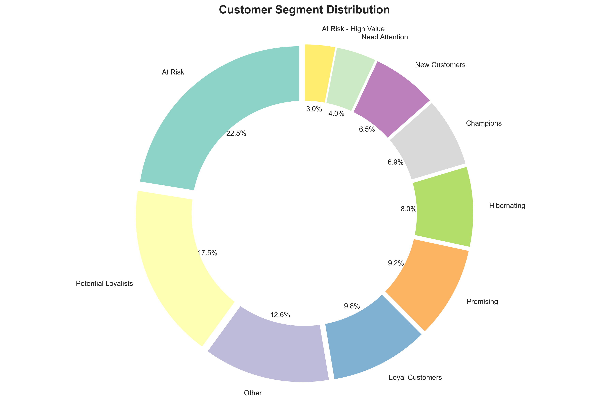
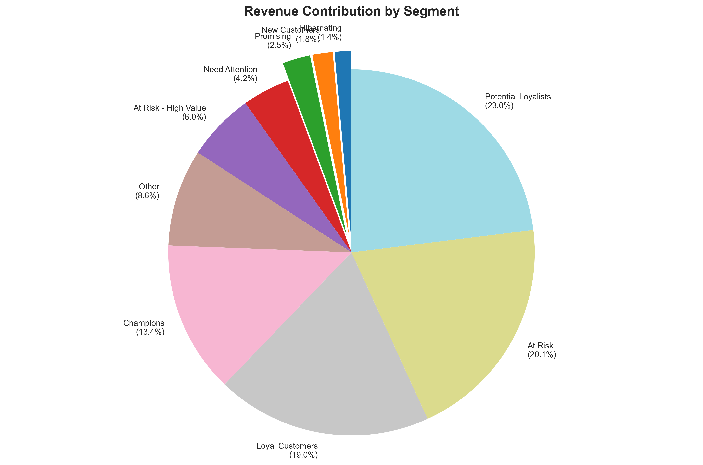
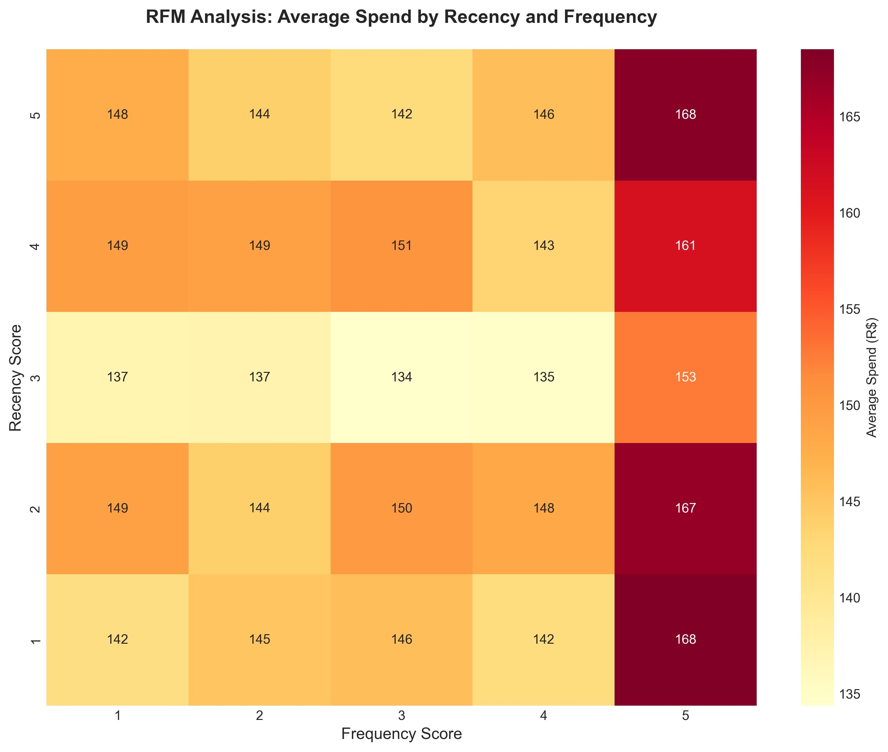
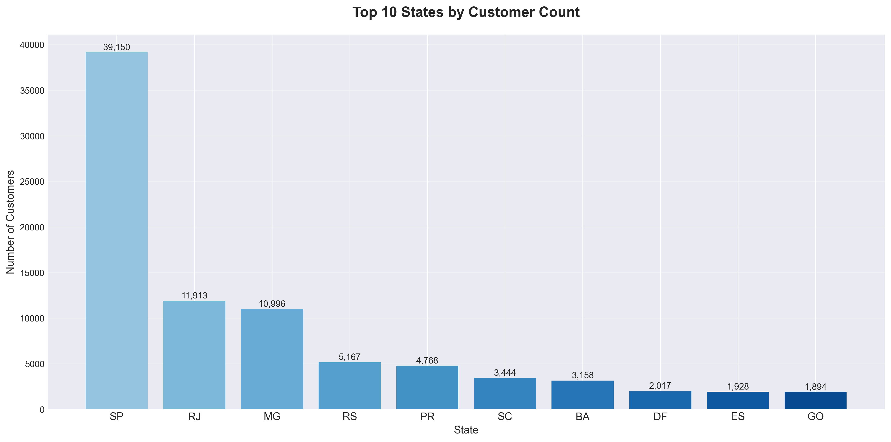
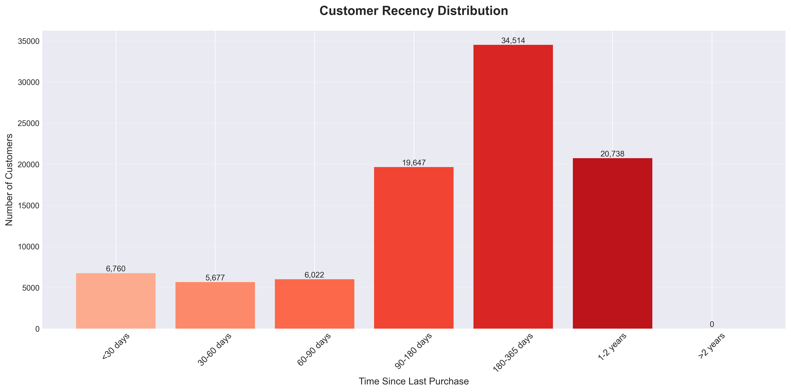

markdown
<div align="center">
  
  # 🛍️ Customer Segmentation Project
  
  [](https://www.python.org)
  [](https://pandas.pydata.org/)
  [](https://matplotlib.org/)
  [](https://opensource.org/licenses/MIT)
  
  <h3>🎯 Turning Raw Data into Business Intelligence</h3>
  <p><i>RFM Analysis on 100,000+ E-Commerce Orders</i></p>
  
  <br>
  
  <!-- Animated divider -->
  
  
</div>

## 📋 Table of Contents
- [🚀 Overview](#-overview)
- [📊 Key Findings](#-key-findings)
- [🎯 Customer Segments](#-customer-segments)
- [📈 Visualizations](#-visualizations)
- [🛠️ Tech Stack](#️-tech-stack)
- [📁 Project Structure](#-project-structure)
- [💡 Business Recommendations](#-business-recommendations)
- [⚙️ How to Run](#️-how-to-run)

<br>

## 🚀 Overview

This project performs **customer segmentation** on **100,000+ e-commerce orders** using **RFM (Recency, Frequency, Monetary)** analysis. Instead of treating all customers the same, it automatically groups them into meaningful segments so businesses can:

<div align="center">
  
| 🎯 Target Marketing | 💰 Increase Revenue | ⚠️ Prevent Churn | 💝 Personalize Experience |
|:---:|:---:|:---:|:---:|
| Send right offers | Focus on high-value | Catch at-risk early | Treat customers uniquely |

</div>

<br>

<div align="center">
  
</div>

## 📊 Key Findings

<div align="center">

### 👥 Customer Distribution

| Segment | Customers | % of Total | Revenue | % of Revenue | Status |
|:--------|----------:|-----------:|--------:|-------------:|:------:|
| **🏆 Champions** | 6,429 | 6.9% | R$1.85M | 13.4% | 🔥 Best |
| **💝 Loyal** | 9,176 | 9.8% | R$2.62M | 19.0% | ⭐ Great |
| **🌟 Potential** | 16,380 | 17.5% | R$3.18M | 23.0% | 📈 Growing |
| **🆕 New** | 6,067 | 6.5% | R$0.25M | 1.8% | 🌱 Fresh |
| **⚠️ At Risk** | 20,959 | 22.5% | R$2.78M | 20.1% | 🚨 Critical |
| **⚠️ High Value At Risk** | 2,817 | 3.0% | R$0.83M | 6.0% | 🔴 Urgent |
| **💤 Hibernating** | 7,458 | 8.0% | R$0.19M | 1.4% | 😴 Dormant |
| **📦 Others** | 24,072 | 25.8% | R$2.10M | 15.2% | 📋 Mixed |

</div>

<br>

### 💡 **Power Insight**
<div align="center">
  <p><b>Top 3 segments (Champions + Loyal + Potential) = 34.2% of customers → 55.4% of revenue</b></p>
  <p><b>At-risk customers = 33.5% of customers → 27.5% of revenue at stake</b></p>
</div>

<br>

<div align="center">
  
</div>

## 🎯 Customer Segments

<div align="center">

| Segment | Description | Action Needed |
|:--------|:------------|:--------------|
| 🏆 **Champions** | Buy recently, buy often, spend most | 🎁 VIP treatment, exclusive perks |
| 💝 **Loyal** | Regular buyers, good spending | 💳 Loyalty program, cross-selling |
| 🌟 **Potential** | Recent buyers showing promise | 🤝 Nurture, second purchase offer |
| 🆕 **New** | First-time buyers | 👋 Welcome series, education |
| ⚠️ **At Risk** | Used to buy, stopped recently | 📧 Reactivation campaign |
| 🔴 **At Risk High Value** | Big spenders who stopped | 🚨 Urgent win-back offer |
| 💤 **Hibernating** | Long time no buy | 💤 Final reactivation attempt |
| 📦 **Others** | Mixed behavior | 🔍 Monitor & analyze |

</div>

<br>

<div align="center">
  
</div>

## 📈 Visualizations

<div align="center">
  <h3>🖼️ Charts Generated</h3>
</div>

<table align="center">
  <tr>
    <td width="50%"><b>📊 Segment Distribution</b><br></td>
    <td width="50%"><b>💰 Revenue by Segment</b><br></td>
  </tr>
  <tr>
    <td width="50%"><b>💵 Average Spend by Segment</b><br></td>
    <td width="50%"><b>🔥 RFM Heatmap</b><br></td>
  </tr>
  <tr>
    <td width="50%"><b>🗺️ Top States</b><br></td>
    <td width="50%"><b>⏰ Recency Distribution</b><br></td>
  </tr>
</table>

<br>

<div align="center">
  
</div>

## 🛠️ Tech Stack

<div align="center">

| | | |
|:---:|:---:|:---:|
|  |  |  |
| **Python 3.11** | **Pandas** | **NumPy** |
|  |  | **RFM Analysis** |
| **Matplotlib** | **Seaborn** | **Methodology** |

</div>

<br>

<div align="center">
  
</div>

📁 Project Structure
text
📦 customer_segmentation_project
├── 📂 python/
│   ├── 📄 01_data_exploration.py     # Explore raw data
│   ├── 📄 02_data_preparation.py      # Clean & merge datasets
│   ├── 📄 03_customer_metrics.py      # Calculate RFM scores
│   ├── 📄 04_rfm_segmentation.py      # Create customer segments
│   ├── 📄 05_visualizations.py        # Generate all charts
│   └── 📄 06_final_report.py          # Create HTML reports
│
├── 📂 figures/                         # 8 generated charts
│   ├── 🖼️ segment_distribution_pie.png
│   ├── 🖼️ revenue_by_segment.png
│   ├── 🖼️ avg_spend_by_segment.png
│   ├── 🖼️ rfm_heatmap.png
│   ├── 🖼️ top_states.png
│   ├── 🖼️ recency_distribution.png
│   ├── 🖼️ state_composition.png
│   └── 🖼️ value_distribution.png
│
└── 📂 reports/                          # Final outputs
    ├── 📄 customer_segmentation_report.html
    ├── 📄 segment_summary.csv
    └── 📄 executive_summary.txt

💡 Business Recommendations
🏆 For Champions (Best Customers)
text
┌─────────────────────────────────────────────────────┐
│  ✓ VIP loyalty program with exclusive perks         │
│  ✓ Early access to new products                     │
│  ✓ Personalized thank-you notes                     │
│  ✓ Referral program with bonuses                    │
│                                                     │
│  └─ 📈 Expected: +20% increase in spending          │
└─────────────────────────────────────────────────────┘
⚠️ For At-Risk (Customers Leaving)
text
┌─────────────────────────────────────────────────────┐
│  ✓ "We miss you" email campaign                     │
│  ✓ 25-30% reactivation discount                     │
│  ✓ Feedback survey to understand why they left      │
│  ✓ Showcase new products in their favorite categories│
│                                                     │
│  └─ 📈 Expected: Recover 25% of at-risk revenue     │
└─────────────────────────────────────────────────────┘
🆕 For New Customers
text
┌─────────────────────────────────────────────────────┐
│  ✓ 3-email welcome series                           │
│  ✓ 15% off second purchase                          │
│  ✓ Product tips and guides                          │
│  ✓ Easy reorder options                             │
│                                                     │
│  └─ 📈 Expected: 30% higher second purchase rate    │
└─────────────────────────────────────────────────────┘
💝 For Loyal Customers
text
┌─────────────────────────────────────────────────────┐
│  ✓ Points-based loyalty program                     │
│  ✓ Related product recommendations                  │
│  ✓ Birthday/anniversary discounts                   │
│  ✓ Early access to sales                            │
│                                                     │
│  └─ 📈 Expected: 15% more frequent orders           │
└─────────────────────────────────────────────────────┘

## ⚙️ How to Run

<div align="left">

### 1️⃣ Clone the repository
```bash
git clone https://github.com/kumshivam0712/customer_segmentation_project.git
cd customer_segmentation_project
2️⃣ Install dependencies
bash
pip install pandas numpy matplotlib seaborn
3️⃣ Download dataset
Go to Kaggle Dataset

Download and extract CSV files into data/ folder

4️⃣ Run scripts in order
bash
cd python
python 01_data_exploration.py
python 02_data_preparation.py
python 03_customer_metrics.py
python 04_rfm_segmentation.py
python 05_visualizations.py
python 06_final_report.py
5️⃣ View results
📊 Charts: Check figures/ folder

📑 Report: Open reports/customer_segmentation_report.html

📋 Summary: Read reports/executive_summary.txt

</div>
<div align="center">  </div>
📊 Key Metrics to Track
<div align="center">
Metric	Current	Target
🔄 Repeat Customer Rate	30.4%	40%
🏆 Champions Revenue Share	13.4%	20%
📈 At-Risk Recovery Rate	0%	25%
💰 Customer Lifetime Value	R$160	R$200
</div>
<div align="center">  </div>
📝 License
<div align="center">
This project is licensed under the MIT License - feel free to use, modify, and share!

</div>
<div align="center">
⭐ If you find this project useful, please star it!

Happy Analyzing! 🚀

</div> ```
